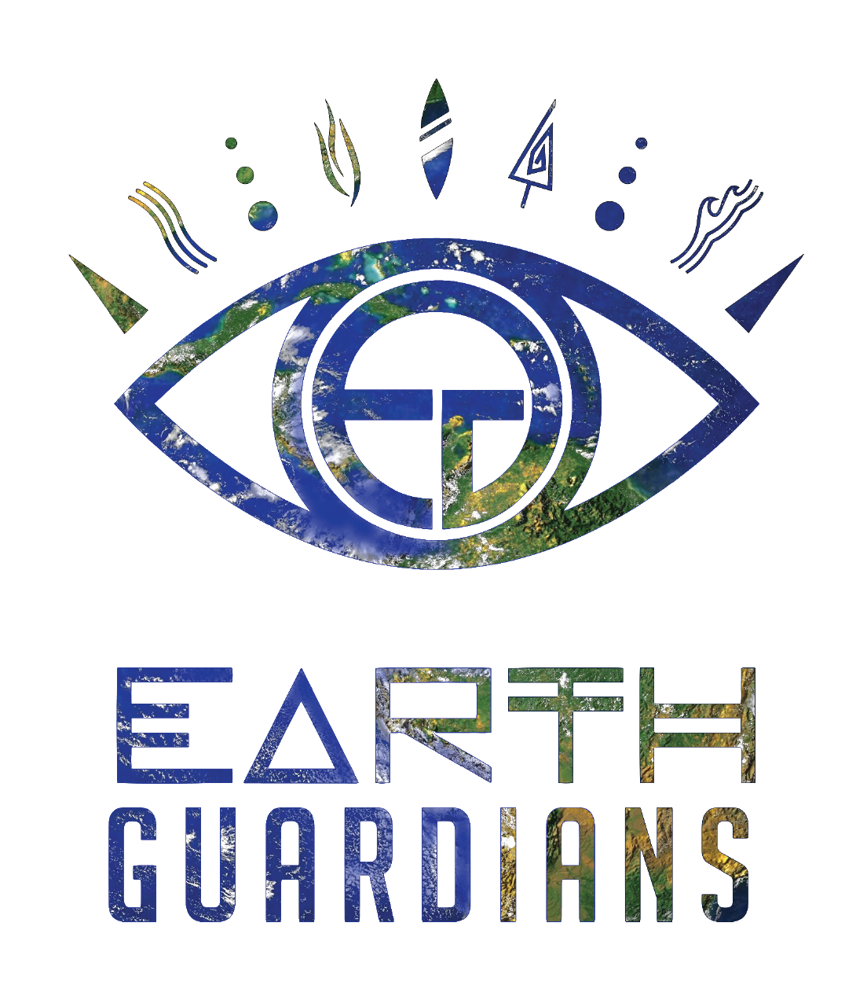
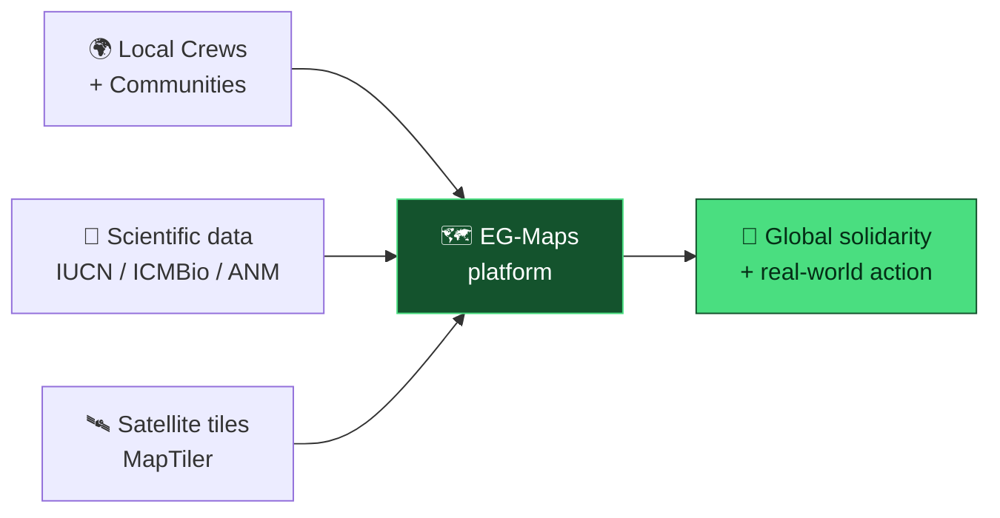
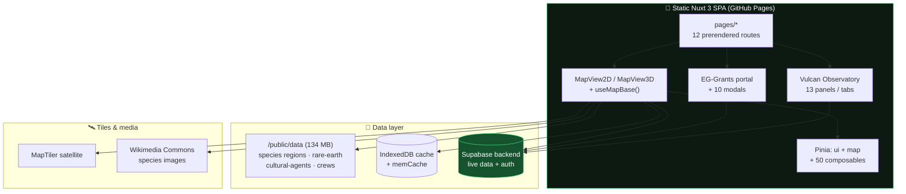
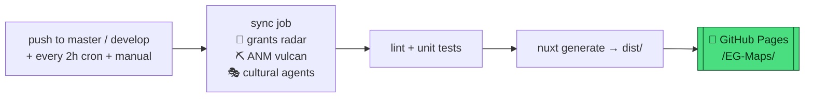

<div align="center">



# 🌎 EG-Maps — Map of Guardianship

[](https://github.com/guardioesdaterra/EG-Maps)

**An interactive mapping platform visualizing endangered species, grassroots grants, active crews and mining threats — built with Nuxt 3, Vue 3, MapLibre GL and Supabase.**

[](https://nuxt.com)
[](https://vuejs.org)
[](https://www.typescriptlang.org)
[](https://maplibre.org)
[](https://supabase.com)
[](https://guardioesdaterra.github.io/EG-Maps/)
[](https://pnpm.io)
[](https://earthguardians.org)

### 🚀 [Live Demo](https://guardioesdaterra.github.io/EG-Maps/) · 📖 [Docs](#-documentation) · 🐛 [Report an Issue](https://github.com/guardioesdaterra/EG-Maps/issues) · 💚 [Share Your Story](mailto:crews@earthguardians.org)

</div>

---

## 📋 Table of Contents

<details open>
<summary><b>Click to expand</b></summary>

- [🌱 About](#-about)
- [🗺️ The Four Data Worlds](#️-the-four-data-worlds)
- [✨ Features](#-features)
- [🏗️ Architecture](#️-architecture)
- [🛠 Tech Stack](#-tech-stack)
- [🚀 Getting Started](#-getting-started)
- [📜 Scripts](#-scripts)
- [📁 Project Structure](#-project-structure)
- [🗄️ Data & Backend](#️-data--backend)
- [🌐 Internationalization](#-internationalization)
- [🧪 Testing](#-testing)
- [🚢 Deployment & CI](#-deployment--ci)
- [📚 Documentation](#-documentation)
- [🤝 Contributing](#-contributing)
- [🙏 Acknowledgments](#-acknowledgments)
- [📞 Contact](#-contact)

</details>

---

## 🌱 About

> *"True conservation outcomes are driven by youth, local communities, and grassroots action on the ground."*

This platform emerged from Earth Guardians' mission to build a **truly inclusive, decentralized conservation tool**. Top-down scientific databases often miss the full story — local knowledge and frontline context are essential for understanding and protecting biodiversity.



### Why this platform exists

| # | Goal | How the map delivers it |
|---|------|-------------------------|
| 1 | **Ground global crises into reality** | Species, grants, crews and mining claims rendered as interactive 2D/3D maps — not abstract stats |
| 2 | **Amplify local voices** | Crew stories and community pins featured directly on the global map |
| 3 | **Build global solidarity** | Shared data + narratives connect efforts across continents |
| 4 | **Turn data into action** | Grants portal, mining-threat observatory and export tools for real-world impact |

### Who it's for

- 🧒 **Earth Guardians Crews** — share local conservation work and see it on the global map
- 🔬 **Researchers & conservationists** — explore species data and ecosystems under threat
- 📚 **Educators & activists** — teach and inspire action with live visuals
- 🌍 **Anyone who cares** — explore, learn, join the movement

---

## 🗺️ The Four Data Worlds

Every world ships in **2D** (MapLibre GL) and **3D** (globe) flavors:

| World | 2D | 3D | What you'll find |
|-------|----|----|------------------|
| 🌱 **Project Grants** | [`/project-grants`](https://guardioesdaterra.github.io/EG-Maps/project-grants) | [`/project-grants/3d`](https://guardioesdaterra.github.io/EG-Maps/project-grants/3d) | Grassroots grant initiatives + beneficiary stats worldwide |
| 🐆 **Endangered Species** | [`/endangered-species`](https://guardioesdaterra.github.io/EG-Maps/endangered-species) | [`/endangered-species/3d`](https://guardioesdaterra.github.io/EG-Maps/endangered-species/3d) | Critically endangered wildlife + habitats (IUCN / ICMBio, region-chunked, IndexedDB-cached) |
| 🔥 **Active Crews** | `/active-crews` | `/active-crews/3d` | ~131 registered Earth Guardians crews around the planet |
| ⛏️ **Vulcan Observatory** | `/vulcan-observatory` | `/vulcan-observatory/3d` | Mining-threat monitoring: rare-earth claims, overlaps, danger scores, water defense, year-slider timeline |

### Plus these experiences

| Route | Experience |
|-------|-----------|
| 💸 `/eg-grants` + `/eg-grants/fullscreen` | Grants discovery portal — globe + worldwide grid, 60+ scraped sources, deadlines, amounts, manager approvals, voting & comments |
| 🎓 `/masterclasses` · 📣 `/campaigns` · 🗂️ `/crew-projects` | Learning, campaign and crew-project hubs |
| 🖼️ `/iframe` + `/iframe/squarespace` | Lightweight embed builds (`postMessage` API, `?hideAll` / `?no-control` / `?embed` flags) for Squarespace & partners |
| ℹ️ `/info` · 🏠 `/` | About/feedback page + cinematic Three.js hero landing |

---

## ✨ Features

<details open>
<summary><b>🗺️ Visualization engine</b></summary>
<br/>

- **2D maps + 3D globes** — MapLibre GL satellite/streets basemaps, WebGL globe views
- **Smart clustering** — Supercluster DOM markers for small sets, GPU-native GeoJSON clustering for 500–10,000+ points (automatic switch)
- **Connection lines + particles** — curved bezier links with animated canvas particles
- **Hex-grid overlay** — canvas hex analysis layer with debounced resize
- **Adaptive quality** — `low / medium / high / ultra` presets auto-tune particles, DPR cap, tile cache and marker budgets from device capability
- **Offline tiles** — MBTiles fallback downloader (`pnpm tiles:download`)
- **Custom data import** — user-uploaded CSV / GeoJSON / KML / KMZ rendered as map layers
- **One-click export** — snapshot to PNG/PDF, download visible data as GeoJSON

</details>

<details>
<summary><b>🎛️ Interaction & UX</b></summary>
<br/>

- **⌘K command palette** + full keyboard shortcuts and `Ctrl+K` search
- **Live search & filters** — region, ecosystem, threat type, taxonomic group, text search
- **Per-type rich popups** — species / project / crew / mining-claim cards, fullscreen overlay mode
- **Shareable state** — filters + view encoded in URL hash/query for deep links
- **Dark / light mode** — pre-paint boot script, zero flash, system-preference aware
- **Fullscreen + embed modes** — immersive viewing and partner embeds
- **Responsive + accessible** — fluid `clamp()` type, skip-link, focus-trapped modals, ARIA labels

</details>

<details>
<summary><b>🔌 Live data & community</b></summary>
<br/>

- **Supabase-backed** — auth (Google OAuth PKCE), grants CRUD, crew registration, community pins, live observatory channels
- **Grants radar** — background scraper (60+ sources) synced to Supabase every 2h via CI
- **Vulcan mining monitor** — ANM sync pipeline, overlap analysis, danger scoring, water-defense layers
- **Cultural agents** — ~2k community/cultural markers synced from external registries
- **Plausible analytics** (opt-in via env) · **PWA manifest** · **16-language UI**

</details>

---

## 🏗️ Architecture



**Render pipeline (typical map page):**

```
pages/endangered-species/index.vue
 └─ <ClientOnly><MapView2D dataset="endangered-species" /></ClientOnly>
     └─ useMapBase()  (~1000 LOC orchestrator)
         ├─ useMapMarker()      clustered markers (DOM ↔ native GeoJSON)
         ├─ useMapConnections() bezier lines + particle canvas
         ├─ useMapHexGrid()     hex overlay canvas
         ├─ useMapPopup/*       species / project / crew cards
         ├─ useRareEarthController() + useCulturalLayers()
         └─ initMap() → style.load → rebuildMarkers() → on('error') → demotiles fallback
```

> Deep-dive: [`docs/ARCHITECTURE.md`](docs/ARCHITECTURE.md) · full module index: [`DOCUMENTATION.md`](DOCUMENTATION.md)

---

## 🛠 Tech Stack

<div align="center">

[](https://skillicons.dev)

</div>

| Category | Technology | Version |
|----------|-----------|---------|
| Framework | **Nuxt 3** (static SSG, `nitro.preset: static`) | `^3.21.6` |
| UI | **Vue 3** Composition API (`<script setup>`) + **Pinia** | `^3.5.34` / `^3.0.4` |
| Language | **TypeScript** (strict) | `^6.0.3` |
| Map engine | **MapLibre GL** + **Three.js** hero globe + `supercluster` | `^5.24.0` / `^8.0.1` |
| Styling | **Tailwind CSS** v3 + VueUse Motion + GSAP | `^3.4.19` |
| Backend | **Supabase** (Postgres + Auth + Storage + Edge Functions) | `^2.49.1` |
| i18n | **@nuxtjs/i18n** + Vue-i18n, 16 locales, EN fallback | `^10.4.0` |
| Icons | Iconify (`<iconify-icon>` web component, Lucide set) | `^3.0.2` |
| Testing | **Vitest** (happy-dom) + **Playwright** (3 configs) | `^4.1.7` / `^1.60.0` |
| Tooling | pnpm · ESLint (`@nuxt/eslint`) · Prettier · `vue-tsc` | pnpm `10.12.0`, Node `22` |
| Deploy | **GitHub Pages** via `nuxt generate` → `dist/` | — |

---

## 🚀 Getting Started

### Prerequisites

- **Node.js 22** (see CI) · **pnpm 10.12** · a free **[MapTiler API key](https://cloud.maptiler.com/)** · (optional) a **[Supabase project](https://supabase.com)** for auth/grants/pins

### Installation

```bash
# Clone
git clone https://github.com/guardioesdaterra/EG-Maps.git
cd EG-Maps

# Install (exact versions)
pnpm install

# Configure environment
cp .env.example .env
```

### Environment

```env
# 🛰️ Map tiles (required)
NUXT_PUBLIC_MAPTILER_API_KEY=your_api_key_here

# 🔌 Supabase — auth, grants, community pins (required for live features)
NUXT_PUBLIC_SUPABASE_URL=https://your-project.supabase.co
NUXT_PUBLIC_SUPABASE_KEY=your-anon-key-here

# 🌍 Deployment base (GitHub Pages subdirectory)
NUXT_APP_BASE_URL=/

# 📊 Analytics (optional)
NUXT_PUBLIC_PLAUSIBLE_DOMAIN=
```

### Development

```bash
pnpm dev        # 🔥 dev server + HMR → http://localhost:3000
pnpm build      # 🏗️ production build
pnpm generate   # 📦 static site → dist/ (what GitHub Pages serves)
pnpm preview    # 👀 preview the production build
pnpm lint       # 🔍 eslint
pnpm format     # 💅 prettier --write .
pnpm test       # ✅ vitest unit tests
```

---

## 📜 Scripts

| Script | Command | What it does |
|--------|---------|--------------|
| 🔥 Dev | `pnpm dev` | Nuxt dev server with HMR |
| 🏗️ Build | `pnpm build` | Production `nuxt build` |
| 📦 Generate | `pnpm generate` | Static prerender → `dist/` |
| 👀 Preview | `pnpm preview` | Serve the production build |
| 🔍 Lint / fix | `pnpm lint` / `pnpm lint:fix` | ESLint (+ `--fix`) |
| 💅 Format | `pnpm format` / `pnpm format:check` | Prettier write / check |
| ✅ Tests | `pnpm test` / `pnpm test:watch` | Vitest run / watch |
| 🧬 Species index | `pnpm species:index` | Rebuild species search index |
| 🌱 Crew grants | `pnpm crew-grants:generate` / `:check` | Generate / verify crew-grant links |
| 🗺️ Tiles | `pnpm tiles:download` / `pnpm tiles:stats` | Offline MBTiles fetch / stats |
| ☁️ Edge functions | `pnpm supabase:deploy` | Deploy all 5 Supabase edge functions |

Plus `scripts/` power tools: `sync-grants-to-supabase.ts` (radar → DB), `sync-anm-vulcan.mjs` + `sniff-anm.mjs` (mining data), `scan-i18n.ts` + `update-locales.mjs` (translations), `compute-overlaps.mjs` (claim overlaps), CSV/GeoJSON/KML/KMZ parsers in `lib/parsers/`.

---

## 📁 Project Structure

```
EG-Maps/
├── app.vue · error.vue          # Root shell (skip-link, transitions, Plausible) + error page
├── pages/                       # File-based routing (12 prerendered routes)
│   ├── index.vue                # 🏠 Cinematic landing (Three.js hero)
│   ├── info.vue · campaigns.vue · crew-projects.vue · masterclasses.vue
│   ├── project-grants/{index,3d}.vue      # 🌱 2D + 3D
│   ├── endangered-species/{index,3d}.vue  # 🐆 2D + 3D
│   ├── active-crews/{index,3d}.vue        # 🔥 2D + 3D
│   ├── vulcan-observatory/{index,3d}.vue  # ⛏️ 2D + 3D
│   ├── eg-grants/{index,fullscreen}.vue   # 💸 grants portal
│   ├── iframe/{index,squarespace}.vue     # 🖼️ embeds
│   ├── auth/callback.vue                  # 🔐 OAuth landing
│   └── globe.vue                          # ↪️ 301 → /project-grants/3d
├── components/                  # 83 Vue SFCs
│   ├── MapView2D.vue · MapView3D.vue · GlobeView.vue · UnifiedMap.vue
│   ├── map/                     # Species / Project / Crew popups + panels
│   ├── grants/                  # Dashboard + 10 modals (create, review, claim…)
│   ├── observatory/             # Sidebar, tabs, tables, sliders, modals
│   └── ui/                      # Button, Input, Sheet, Tooltip, Skeleton, StatCard…
├── composables/                 # 50+ shared-logic units
│   ├── useMapBase.ts            # 🧠 map orchestrator (~1000 LOC)
│   ├── useMapMarker / Connections / HexGrid / Popup / Lib / TileProvider…
│   ├── useSpeciesData / Icons / Panel · useGrants · useUserPin
│   ├── useRareEarth* · useVulcan* · useWaterLayers · useCultural*
│   └── useSupabase / Auth · useI18n · useDarkMode · useCommandPalette · useToast…
├── lib/                         # 28 pure modules (no Vue deps)
│   ├── types.ts · constants.ts · colors.ts · utils.ts · supabase.ts
│   ├── project-data.ts · crew-data.ts · enterprise-data.ts · rare-earth-geo-data.ts
│   ├── map-utils / map-export / map-effects · species-utils · image-utils
│   ├── observatory-* · territory-dossier · water-defense · cultural-marker-taxonomy
│   └── parsers/                 # csv · geojson · kml · kmz
├── stores/                      # Pinia — ui.ts (locale/theme/palette) + map.ts
├── locales/                     # 16 languages (see i18n table below)
├── i18n/i18n.config.ts          # vue-i18n bundle config
├── public/data/                 # 134 MB static datasets (species regions, rare-earth, crews…)
├── supabase/migrations/         # SQL migrations (grants table…)
├── supabase/functions/           # Edge functions (grants, crew-sync, … — downloaded via `npx supabase functions download`)
├── scripts/                     # Dataset builders, sync + scrape pipelines
├── tests/                       # Vitest unit + Playwright E2E (17 files)
├── docs/                        # Topic guides (architecture, API, DB, contributing…)
├── assets/css/main.css · layouts/ · plugins/ · server/
├── nuxt.config.ts · tailwind.config.ts · tsconfig.json · vitest.config.ts
└── .github/workflows/           # deploy · crew-grants · anm-sync
```

---

## 🗄️ Data & Backend

### Datasets

| Dataset | Source | Loading |
|---------|--------|---------|
| 🌱 Projects | `lib/project-data.ts` | Bundled in JS payload |
| 🐆 Species | `/public/data/species/{region}.json` + indexes | Lazy per-region → `memCache` → **IndexedDB** (`useSpeciesData`) |
| 🔥 Crews | `lib/crew-data.ts` (~131 crews) | Static registry |
| ⛏️ Rare-earth / protected areas | `/public/data/rare-earth/*.geojson` | Static GeoJSON layers |
| 🎭 Cultural agents | `/public/data/cultural-agents/*.json` | Region-split fetch |
| 🖼️ Species images | Wikimedia Commons (URL-built, cached + SVG fallback) | On demand |

### Live backend

Live features (auth, grants portal, crew registration, community pins, live observatory updates) are powered by a hosted backend — see [`docs/API.md`](docs/API.md) for the endpoint reference.

---

## 🌐 Internationalization

16 languages, synchronous bundle, English fallback:

| Code | Language | Code | Language |
|------|----------|------|----------|
| `en` | 🇬🇧 English | `es` | 🇪🇸 Español |
| `fr` | 🇫🇷 Français | `pt` | 🇧🇷 Português |
| `ar` | 🇸🇦 العربية | `hi` | 🇮🇳 हिन्दी |
| `ja` | 🇯🇵 日本語 | `zh` | 🇨🇳 中文 |
| `nl` | 🇳🇱 Nederlands | `de` | 🇩🇪 Deutsch |
| `it` | 🇮🇹 Italiano | `ko` | 🇰🇷 한국어 |
| `pl` | 🇵🇱 Polski | `ru` | 🇷🇺 Русский |
| `sv` | 🇸🇪 Svenska | `tr` | 🇹🇷 Türkçe |

```jsonc
// locales/en.json → mirrored to every locale
{ "nav": { "home": "Home" }, "mapControls": { "search": "Search" } }
```

Add a key in `locales/en.json`, mirror it with `node scripts/update-locales.mjs`, audit coverage with `node scripts/scan-i18n.ts`, use it via `t('path.to.key')`.

---

## 🧪 Testing

```bash
pnpm test                                   # ✅ unit (vitest + happy-dom)
pnpm test:watch                             # 👀 watch mode
pnpm exec playwright test                   # 🌐 e2e (dev server)
pnpm exec playwright test --config playwright.static.config.ts    # 📦 e2e vs static build
pnpm exec playwright test --config playwright.deployed.config.ts  # 🚀 e2e vs deployed site
```

| Type | Files | Covers |
|------|-------|--------|
| Unit (Vitest `tests/**/*.test.ts`) | `utils`, `useToast`, `useThreeGlobe`, `useCommandPalette`, crew-grants, observatory normalize, map filters, cultural taxonomy, water-defense, vulcan overlays… | Utils, composables, domain math |
| E2E (Playwright specs) | `routes`, `map-rendering`, `globe-panels`, `observatory`, `sq-repro` | Route loads, panels, map rendering, embeds |

---

## 🚢 Deployment & CI



- **Static hosting** — `pnpm generate` prerenders all 12 routes (see `nuxt.config.ts → nitro.prerender.routes`); output `dist/` is deployed to GitHub Pages under `/EG-Maps/`
- **Production env** — `NUXT_PUBLIC_MAPTILER_API_KEY` + `NUXT_APP_BASE_URL=/EG-Maps/` (+ Supabase vars for live features)
- **Scheduled refresh** — the grants radar re-scrapes and redeploys **every 2 hours** so deadlines never go stale
- **Workflows** — [`deploy.yml`](.github/workflows/deploy.yml) (sync → lint → build → Pages) · [`crew-grants.yml`](.github/workflows/crew-grants.yml) · [`anm-sync.yml`](.github/workflows/anm-sync.yml)

---

## 📚 Documentation

| Doc | What you'll learn |
|-----|-------------------|
| [🏗️ Architecture](docs/ARCHITECTURE.md) | Structure, component design, rendering pipeline |
| [🔌 API Reference](docs/API.md) | Backend endpoints, payloads, responses |
| [🤝 Contributing](docs/CONTRIBUTING.md) | Setup, conventions, PR guidelines |
| [🧠 Full Codebase Docs](DOCUMENTATION.md) | Module-by-module index, data flow, ops runbook |
| [🖼️ Squarespace Embed](docs/squarespace-embed.md) | Partner embed integration |
| [🔄 ANM Sync](docs/anm-sync.md) | Mining-data pipeline |
| [📊 Campaign Research](docs/campaign-research-2026-09-08.md) | Campaign dataset notes |

---

## 🤝 Contributing

### 💚 Share your story (no code needed!)

**Your local knowledge matters.** Scientific databases miss context that communities possess.

1. 🗺️ **Explore the map** — any endangered species near you?
2. 📧 **Email [crews@earthguardians.org](mailto:crews@earthguardians.org)** — crew stories, wildlife photos, ecosystem updates
3. 🌟 **Get featured** — grassroots narratives integrated directly into the map

Help keep species entries, red-list links and crew data fresh — report what's missing in your region.

### 💻 Contribute code

```bash
# 1. Fork → clone → branch
git checkout -b feat/my-feature

# 2. Develop + verify
pnpm dev        # iterate
pnpm lint       # must pass
pnpm test       # must pass

# 3. Commit (conventional commits) + open a PR
git commit -m "feat: add ecosystem filter preset"
```

**Standards:** strict TypeScript · Vue 3 `<script setup>` · Tailwind utilities first · ARIA labels on interactive elements · tests for new logic · `cn()` (`clsx` + `tailwind-merge`) for classes.

| Prefix | Use for |
|--------|---------|
| `feat:` | New feature |
| `fix:` | Bug fix |
| `docs:` | Docs only |
| `style:` | Layout / visuals |
| `refactor:` | Code restructure |
| `test:` / `chore:` | Tests / tooling |

Full guide: [`docs/CONTRIBUTING.md`](docs/CONTRIBUTING.md)

---

## 🙏 Acknowledgments

- 💚 **Earth Guardians Crews** — frontline knowledge, stories, photos
- 🛰️ **MapTiler** — tile services · 🗺️ **MapLibre GL** — open-source rendering
- 🖼️ **Wikimedia Commons** — species imagery · 📕 **IUCN Red List / ICMBio** — conservation data
- 🔣 **Lucide / Iconify** — icons · 🔌 **Supabase** — backend primitives

---

<div align="center">

### 📞 Contact

🌐 **[earthguardians.org](https://earthguardians.org)** · 📧 **[crews@earthguardians.org](mailto:crews@earthguardians.org)** · 🐛 **[Issues](https://github.com/guardioesdaterra/EG-Maps/issues)**

<br/>

**Rising together.** 🌱 Built with 💚 by Earth Guardians and the global Crew network.

</div>
